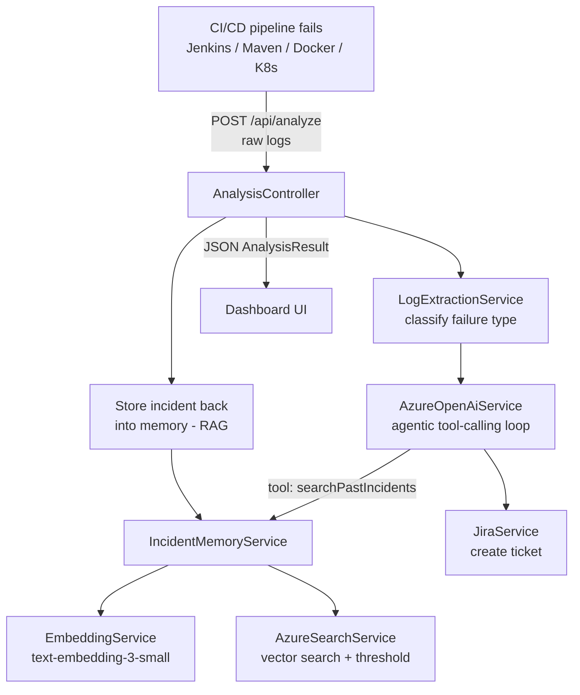

# 🛠️ DevOps AI Copilot

> **Agentic RAG for Self-Healing CI/CD Pipelines** — an autonomous AI agent that
> reads raw build logs, diagnoses the root cause of a pipeline failure in seconds,
> files a Jira ticket automatically, and learns from every incident so the whole
> team gets faster over time.

Built for the **Agents League Hackathon — Enterprise Agents** challenge using
Spring Boot, Azure OpenAI (tool-calling agent), Azure AI Search (vector RAG),
and the Jira REST API.

---

## Table of contents
- [What it does](#what-it-does)
- [Architecture](#architecture)
- [End-to-end workflow](#end-to-end-workflow)
- [Tech stack](#tech-stack)
- [Prerequisites](#prerequisites)
- [Configuration](#configuration)
- [Run it locally](#run-it-locally)
- [Using the dashboard](#using-the-dashboard)
- [API reference](#api-reference)
- [Jenkins integration](#jenkins-integration)
- [How the RAG memory works](#how-the-rag-memory-works)
- [Project structure](#project-structure)
- [Troubleshooting](#troubleshooting)

---

## What it does

When a CI/CD pipeline fails, engineers waste time scrolling through thousands of
lines of build logs to find the one error that matters. **DevOps AI Copilot**
automates that triage:

1. **Ingests raw pipeline logs** (Jenkins, Maven, Docker, Kubernetes).
2. **Classifies the failure** into one of several known types.
3. **Reasons about the root cause** with an agentic Azure OpenAI loop that can
   call tools (including searching past incidents).
4. **Retrieves similar past failures** from a vector-based institutional memory
   (RAG) — with a similarity threshold so only genuine matches surface.
5. **Auto-creates a Jira ticket** with severity, root cause, and a suggested fix.
6. **Persists the incident** back into memory so the agent keeps learning.

A live dark-themed dashboard shows the agent's reasoning trace, matched past
incidents, and learning metrics in real time.

### Supported failure types
`MAVEN_COMPILATION` · `UNIT_TEST` · `DEPENDENCY_RESOLUTION` · `KUBERNETES_CRASH` ·
`IMAGE_PULL` · `OOM_KILLED` · `DOCKER_BUILD` · `NETWORK_TIMEOUT` · `GIT_CHECKOUT` ·
`DISK_SPACE` · `PERMISSION_DENIED` · `UNKNOWN`

---

## Architecture



---

## End-to-end workflow

The full lifecycle of a single failure, step by step:

| # | Stage | Component | What happens |
|---|-------|-----------|--------------|
| 1 | **Trigger** | Jenkins `post { failure }` | On a failed build, the pipeline `curl`s the raw failure log to `POST /api/analyze`. |
| 2 | **Classify** | `LogExtractionService` | Scans the log with keyword rules and assigns a `FailureType` (e.g. `DOCKER_BUILD`). |
| 3 | **Reason** | `AzureOpenAiService` | Runs an agent loop (max 4 turns) on Azure OpenAI `gpt-4.1-mini`. The model can call the `searchPastIncidents` tool. |
| 4 | **Recall** | `IncidentMemoryService` + `AzureSearchService` | Embeds the query, runs a vector search over past incidents, and returns only matches above the similarity threshold. |
| 5 | **Decide** | `AzureOpenAiService` | The model produces a root cause, severity, suggested fix, and a Jira summary. |
| 6 | **Act** | `JiraService` | Creates a Jira ticket (e.g. `SCRUM-17`) with the analysis. |
| 7 | **Learn** | `IncidentMemoryService` | Embeds and stores this new incident so future failures can match against it. |
| 8 | **Report** | Dashboard | Returns a JSON `AnalysisResult`; the UI renders the result card, agent trace, matched incidents, and metrics. |

---

## Tech stack

- **Backend:** Java 17, Spring Boot, Maven
- **LLM:** Azure OpenAI `gpt-4.1-mini` (function/tool calling, agentic loop)
- **Embeddings:** Azure OpenAI `text-embedding-3-small` (1536-dim)
- **Vector store / RAG:** Azure AI Search (HNSW vector index)
- **Ticketing:** Jira Cloud REST API
- **Frontend:** Single-page static dashboard (vanilla HTML/CSS/JS)
- **CI/CD demo:** Jenkins → Docker → Kubernetes (Minikube)

---

## Prerequisites

- **JDK 17+**
- **Maven** (or use the bundled `./mvnw` / `mvnw.cmd` wrapper)
- An **Azure OpenAI** resource with:
  - a chat deployment named `gpt-4.1-mini`
  - an embeddings deployment (e.g. `text-embedding-3-small`)
- An **Azure AI Search** service (an index named `incidents` is created
  automatically on startup)
- A **Jira Cloud** project + API token

---

## Configuration

Configuration lives in `src/main/resources/application.yaml` and is driven by
environment variables. Set the following before running:

| Variable | Description |
|----------|-------------|
| `AZURE_OPENAI_ENDPOINT` | Azure OpenAI endpoint URL |
| `AZURE_OPENAI_KEY` | Azure OpenAI API key |
| `AZURE_OPENAI_EMBEDDING_ENDPOINT` | Embeddings endpoint URL |
| `AZURE_OPENAI_EMBEDDING_DEPLOYMENT` | Embeddings deployment name (default `text-embedding-3-small`) |
| `AZURE_SEARCH_ENDPOINT` | Azure AI Search endpoint URL |
| `AZURE_SEARCH_KEY` | Azure AI Search admin key |
| `AZURE_SEARCH_INDEX` | Index name (default `incidents`) |
| `AZURE_SEARCH_MIN_SCORE` | Minimum vector-similarity score (0–1) for a match (default `0.6`) |
| `JIRA_BASE_URL` | Jira Cloud base URL (e.g. `https://you.atlassian.net`) |
| `JIRA_EMAIL` | Jira account email |
| `JIRA_API_TOKEN` | Jira API token |
| `JIRA_PROJECT_KEY` | Jira project key (e.g. `SCRUM`) |
| `JIRA_ISSUE_TYPE` | Jira issue type (e.g. `Task`) |
| `JIRA_SPRINT_ID` | Target sprint id (optional) |
| `JIRA_SPRINT_FIELD` | Sprint custom field id (default `customfield_10020`) |

> **Tuning matches:** raise `AZURE_SEARCH_MIN_SCORE` if unrelated incidents still
> appear as matches; lower it if genuine matches get dropped. Set to `0` to
> disable filtering entirely.

### Example (PowerShell)

```powershell
$env:AZURE_OPENAI_ENDPOINT="https://<your>.openai.azure.com"
$env:AZURE_OPENAI_KEY="<key>"
$env:AZURE_OPENAI_EMBEDDING_ENDPOINT="https://<your>.openai.azure.com"
$env:AZURE_OPENAI_EMBEDDING_DEPLOYMENT="text-embedding-3-small"
$env:AZURE_SEARCH_ENDPOINT="https://<your>.search.windows.net"
$env:AZURE_SEARCH_KEY="<search-admin-key>"
$env:AZURE_SEARCH_INDEX="incidents"
$env:AZURE_SEARCH_MIN_SCORE="0.6"
$env:JIRA_BASE_URL="https://<you>.atlassian.net"
$env:JIRA_EMAIL="you@example.com"
$env:JIRA_API_TOKEN="<token>"
$env:JIRA_PROJECT_KEY="SCRUM"
$env:JIRA_ISSUE_TYPE="Task"
```

---

## Run it locally

```powershell
cd "devops-ai-copilot"
.\mvnw.cmd spring-boot:run
```

The app starts on **http://localhost:1001**. Open it in a browser to load the
dashboard. The Azure AI Search index is created automatically on first startup.

To build a jar instead:

```powershell
.\mvnw.cmd clean package
java -jar target\devops-ai-copilot-0.0.1-SNAPSHOT.jar
```

---

## Using the dashboard

Open **http://localhost:1001** and you'll see:

1. **Metrics strip** (top) — incidents learned, top failure type, High/Critical
   count, and the match rate of the last run.
2. **Analyze CI/CD failure** (left) — paste raw build logs into the textarea and
   click **Analyze**.
3. **Analysis result** (left) — failure type, severity, the Jira ticket link,
   summary, root cause, and suggested fix.
4. **Agent trace** (right) — a timeline of the agent's reasoning steps and tool
   calls.
5. **Incident memory** (right) — the most recent stored incidents; any that
   matched the current analysis are highlighted.

### Quick manual test

```powershell
# Paste a sample failure log via curl
curl -X POST http://localhost:1001/api/analyze `
  -H "Content-Type: text/plain" `
  --data-binary "@failure-log.txt"
```

The JSON response is the same `AnalysisResult` the dashboard renders.

---

## API reference

Base path: `/api`

### `POST /api/analyze`
Analyze a CI/CD failure log and create a Jira ticket.

- **Consumes:** `text/plain` (raw log body)
- **Produces:** `application/json`

**Response (`AnalysisResult`):**
```json
{
  "failureType": "DOCKER_BUILD",
  "rootCause": "docker login failed: unauthorized",
  "severity": "High",
  "suggestedFix": "Re-authenticate with valid registry credentials...",
  "jiraSummary": "Docker push failed due to unauthorized login",
  "jiraKey": "SCRUM-17",
  "jiraUrl": "https://you.atlassian.net/browse/SCRUM-17",
  "agentSteps": ["...reasoning trace..."],
  "matchedIncidents": [
    { "jiraKey": "SCRUM-12", "failureType": "DOCKER_BUILD", "summary": "..." }
  ]
}
```

### `GET /api/incidents`
Returns all incidents currently in memory. No model calls — safe for dashboards
and demos (consumes no credits).

### `POST /api/incidents`
Seeds a past incident directly into memory (it is embedded on store so it becomes
searchable). Useful for pre-loading demo data.

```json
{
  "failureType": "NETWORK_TIMEOUT",
  "summary": "kubectl could not reach the API server",
  "rootCause": "host.docker.internal port unreachable",
  "suggestedFix": "Ensure Minikube is running and the port is forwarded",
  "severity": "Medium",
  "jiraKey": "SCRUM-09"
}
```

---

## Jenkins integration

The companion `employee-service` repo ships a `Jenkinsfile` whose pipeline runs:

```
Checkout → Build (mvn clean package) → Docker Build → Docker Push
→ Deploy to Minikube (kubectl apply -f k8s/) → Post Actions
```

On failure, the **Post Actions** stage forwards the console log to the copilot:

```groovy
post {
  failure {
    sh '''
      curl -X POST http://host.docker.internal:1001/api/analyze \
        -H "Content-Type: text/plain" \
        --data-binary @failure-log.txt
    '''
  }
}
```

Because `curl` prints the HTTP response body to stdout, the agent's JSON analysis
also appears directly in the Jenkins console log — so engineers see the diagnosis
without leaving Jenkins.

---

## How the RAG memory works

1. Every analyzed incident is converted to text and embedded with
   `text-embedding-3-small`, then upserted into Azure AI Search.
2. During analysis, the agent calls `searchPastIncidents(type, query)`. The query
   is embedded and a **vector (nearest-neighbour) search** runs over the index.
3. **Similarity threshold:** vector search always returns *some* nearest rows, even
   when nothing is genuinely relevant. `AzureSearchService` reads each result's
   `@search.score` and drops anything below `AZURE_SEARCH_MIN_SCORE`. When nothing
   is similar enough, it returns **zero** matches instead of misleading ones.
4. Kept/dropped matches are logged so you can calibrate the threshold:
   ```
   [MEMORY] Keeping match jira=SCRUM-12 score=0.81
   [MEMORY] Dropping weak match jira=SCRUM-11 score=0.42 (< min-score=0.6)
   ```

---

## Project structure

```
devops-ai-copilot/
├── src/main/java/com/analyzer/devopsaicopilot/
│   ├── DevopsAiCopilotApplication.java   # Spring Boot entry point
│   ├── config/                           # Jira + OpenAI client config
│   ├── controller/
│   │   └── AnalysisController.java        # /api/analyze, /api/incidents
│   ├── model/                             # FailureType, AnalysisResult, Incident, ...
│   └── service/
│       ├── LogExtractionService.java      # Keyword-based failure classification
│       ├── AzureOpenAiService.java        # Agentic tool-calling loop
│       ├── IncidentMemoryService.java     # RAG orchestration
│       ├── AzureSearchService.java        # Vector search + similarity threshold
│       ├── EmbeddingService.java          # text-embedding-3-small client
│       └── JiraService.java               # Creates Jira tickets
└── src/main/resources/
    ├── application.yaml                   # Config (env-driven)
    └── static/index.html                  # Dashboard UI
```

---

## Troubleshooting

| Symptom | Likely cause / fix |
|---------|--------------------|
| Unrelated incidents show as "matches" | Raise `AZURE_SEARCH_MIN_SCORE` (e.g. `0.7`). |
| Genuine matches get dropped | Lower `AZURE_SEARCH_MIN_SCORE`. |
| `Failed to ensure search index` on startup | Check `AZURE_SEARCH_ENDPOINT` / `AZURE_SEARCH_KEY`. |
| Jira ticket not created | Verify `JIRA_*` vars, API token, and project key. |
| Large full-pipeline log misclassified as `MAVEN_COMPILATION` | The classifier scans the whole log; an early "compilation error" string can win. Feed the failing tail, or refine `LogExtractionService`. |
| Jenkins can't reach the API | Use `http://host.docker.internal:1001` from inside containers; ensure the app is running on the host. |

---

Built with Spring Boot · Azure OpenAI · Azure AI Search · Jira.